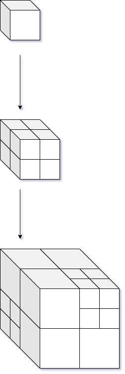
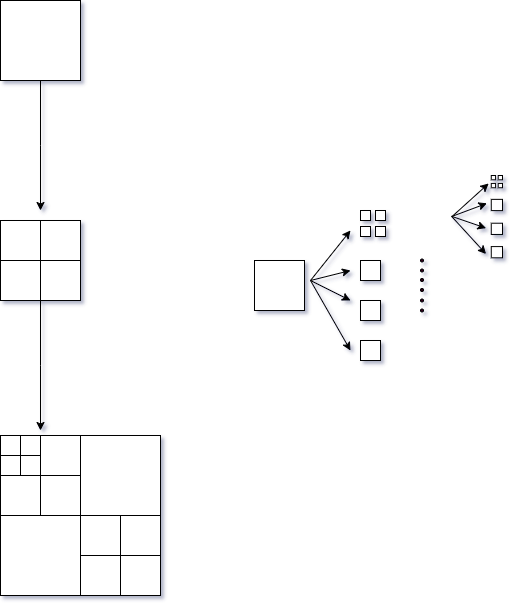
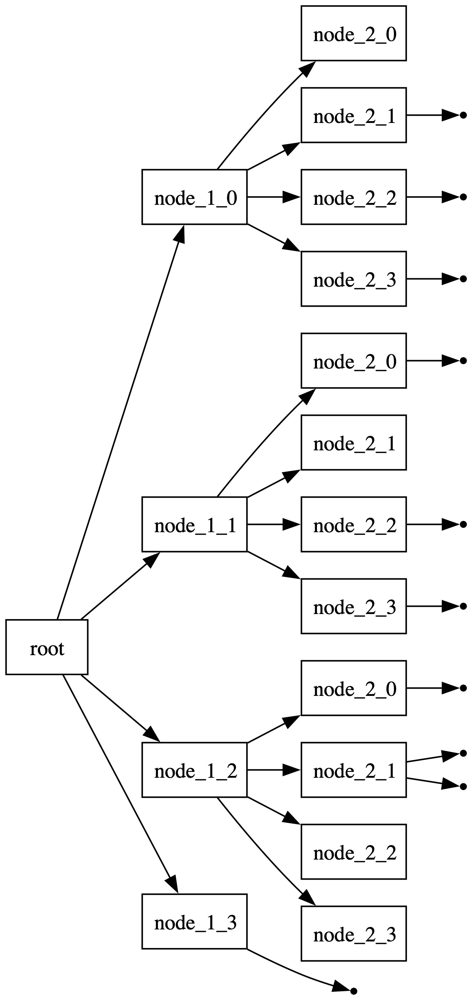

# zearches
[](https://goreportcard.com/report/github.com/cozmo-zh/zearches)
[](https://pkg.go.dev/github.com/cozmo-zh/zearches)
[](https://github.com/cozmo-zh/zearches/actions/workflows/tests.yaml)

Zearches is a simple spatial segmentation/search toolkit that includes Octree, Quadtree, Rtree. It can be used to implement AOI, such as vision management in game projects, and also provides simple intersection detection

## RoadMap
- [x] Octree
- [x] Quadtree
- [x] Rtree
- [ ] simple intersection detection, but it is coming soon

## octree

 

## quadtree




## Installation

```bash
go get -u github.com/cozmo-zh/zearches
```

## Usage
```go
func main() {
    // create an octree
    otree, _ := zearches.CreateOctree(
        bounds.NewBound(
            geo.NewVec3Int(0, 0, 0), geo.NewVec3Int(100, 100, 100)), // bound, required
            1,                          // maxDepth, required
            1,                          // capacity, required
            zearches.WithMergeIf(true), // Flag to determine if nodes should be merged when removing an entity , optional, default is false
            zearches.WithScale(func(v []float32) geo.Vec3Int {
                return geo.NewVec3Int(int32(v[0]), int32(v[1]), int32(v[2]))
            }), // Function to scale float32 slice to geo.Vec3Int , optional, default is identity function
    )
    
	otree.GetSurroundingEntities(
		[]float32{1, 1, 1}, 10, 
	    func(entity siface.ISpatial) bool {
            return entity.GetID() == 999
    })
    
    // create a quadtree
    qtree, _ := zearches.CreateQuadtree(
        bounds.NewBound(geo.NewVec3Int(0, 0, 0), geo.NewVec3Int(100, 100, 100)), // bound, required
        1, // maxDepth, required
        1, // capacity, required
    )
    qtree.Remove(999)
}
```

## Visualization
```go
func main() {
    // create an octree
    otree, _ := zearches.CreateQuadtree(
            //...                   
            zearches.WithDrawPath("${workspace}/dot"), // path to save dot file, optional, default is empty
    )
		
   // ...
   err := octree.ToDot() // it will generate a dot file in the path you specified
```
if you want to visualize the octree, you can use the following command to generate the dot file, then generate the image file by using the graphviz tool
### install graphviz
```bash
brew install graphviz
```
### generate image file
```bash
dot -Tjpg -o octree.png octree.dot
```

