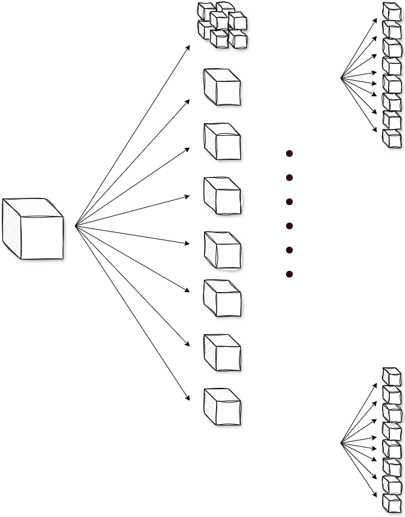

# zearches
Zearch is a simple spatial segmentation/search toolkit that includes Octree, Quadtree, Rtree, and Grid-Based. It can be used to implement AOI, such as vision management in game projects, and also provides simple collision detection.

 

