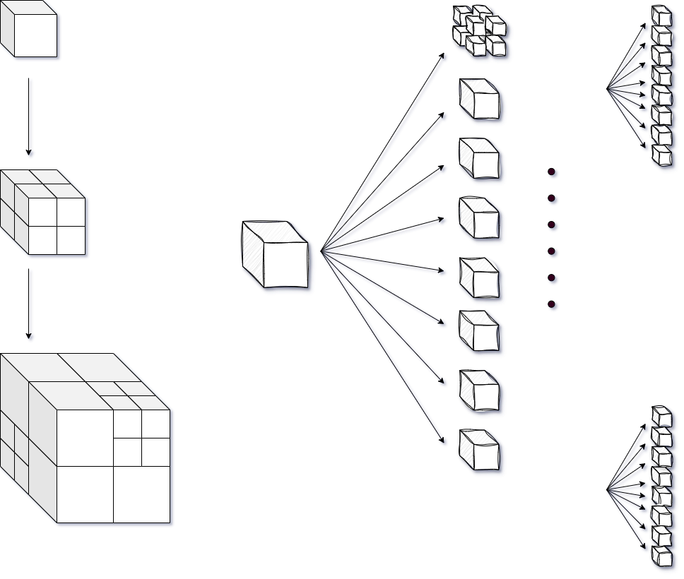

# zearches
Zearches is a simple spatial segmentation/search toolkit that includes Octree, Quadtree, Rtree, and Grid-Based. It can be used to implement AOI, such as vision management in game projects, and also provides simple collision detection.

## octree

 

## quadtree


## Installation

```go
go get -u github.com/cozmo-zh/zearches
```

## Usage

```go
```